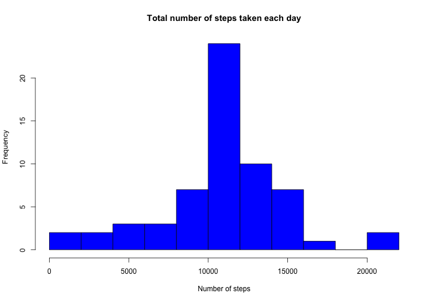

# Reproducible Research: Peer Assessment 1


## Loading and preprocessing the data
Data is loaded using *read.csv()* and then date is trasferred into *date* object in R.


```r
data = read.csv("activity.csv")
data$date = as.Date(data$date)
```

Let us look into first few rows:

```r
head(data)
```

```
##   steps       date interval
## 1    NA 2012-10-01        0
## 2    NA 2012-10-01        5
## 3    NA 2012-10-01       10
## 4    NA 2012-10-01       15
## 5    NA 2012-10-01       20
## 6    NA 2012-10-01       25
```


## What is mean total number of steps taken per day?
To answer this question I have created a aggregate table first.


```r

aggdata = aggregate(data$steps, by = list(data$date), FUN = sum)
ag = aggdata
```

Let us now see how this new table looks like.

```r
head(aggdata)
```

```
##      Group.1     x
## 1 2012-10-01    NA
## 2 2012-10-02   126
## 3 2012-10-03 11352
## 4 2012-10-04 12116
## 5 2012-10-05 13294
## 6 2012-10-06 15420
```

I have now created the histogram ignoring the missing values.


```r
msg = "Total number of steps taken each day"
hist(aggdata$x[!is.na(aggdata$x)], col = "skyblue", breaks = 10, main = msg, 
    xlab = "Number of steps")
```

 

We can now calculate the *mean* and *median* total number of steps taken per day.

```r
paste("Mean total number of steps taken per day:", mean(aggdata$x, na.rm = TRUE))
```

```
## [1] "Mean total number of steps taken per day: 10766.1886792453"
```

```r

paste("Median total number of steps taken per day:", median(aggdata$x, na.rm = TRUE))
```

```
## [1] "Median total number of steps taken per day: 10765"
```

## What is the average daily activity pattern?
To answer this question I have first constructed the table with average number of steps in different 5-minute intervals. 


```r
aggdata = aggregate(data$steps, by = list(data$interval), FUN = mean, na.rm = TRUE)
names(aggdata) = c("interval", "avgsteps")
head(aggdata)
```

```
##   interval avgsteps
## 1        0  1.71698
## 2        5  0.33962
## 3       10  0.13208
## 4       15  0.15094
## 5       20  0.07547
## 6       25  2.09434
```

Now we can plot the time series.

```r
plot(aggdata$interval, aggdata$avgsteps, type = "l", lwd = 2, main = "Time series plot", 
    xlab = "Interval", col = 4, ylab = "Average number of steps")
```

 

To find the 5-minute interval, which on average contains the maximum number of steps, I have sorted the above data in decreasing order of average steps. After that it is easy to find the interval with maximum average number of steps.


```r
head(aggdata[order(aggdata$avgsteps, decreasing = TRUE), ])
```

```
##     interval avgsteps
## 104      835    206.2
## 105      840    195.9
## 107      850    183.4
## 106      845    179.6
## 103      830    177.3
## 101      820    171.2
```

```r
maxinterval = aggdata$interval[order(aggdata$avgsteps, decreasing = TRUE)][1]
paste("5-minute interval containing the maximum number of steps on average:", 
    maxinterval)
```

```
## [1] "5-minute interval containing the maximum number of steps on average: 835"
```


## Imputing missing values
In this section, I have first counted the missing values.

```r
paste("Total mnumber of rows with missing value:", sum(is.na(data$steps)))
```

```
## [1] "Total mnumber of rows with missing value: 2304"
```

After that I have taken a backup of original data set and replaced all the missing values in the back up data set by the mean steps for corresponding 5-minute intervals. The new data set with this modified values is named as *data2*.


```r
data2 = data
for (i in 1:length(aggdata[[1]])) {
    place = is.na(data2$steps) & (data2$interval == aggdata$interval[i])
    data2$steps[place] = aggdata$avgsteps[i]
}

head(data2)
```

```
##     steps       date interval
## 1 1.71698 2012-10-01        0
## 2 0.33962 2012-10-01        5
## 3 0.13208 2012-10-01       10
## 4 0.15094 2012-10-01       15
## 5 0.07547 2012-10-01       20
## 6 2.09434 2012-10-01       25
```


We can now calculate the aggregate once again with this modified data.

```r

aggdata2 = aggregate(data2$steps, by = list(data2$date), FUN = sum)
```

We cal also create the histogram after replacing the missing values.


```r
hist(aggdata2$x, col = "blue", breaks = 10, main = "Total number of steps taken each day", 
    xlab = "Number of steps")
```

 

I have also re-calculated the *mean* and *median* total number of steps taken per day.

```r
paste("Mean total number of steps taken per day:", mean(aggdata2$x))
```

```
## [1] "Mean total number of steps taken per day: 10766.1886792453"
```

```r

paste("Median total number of steps taken per day:", median(aggdata2$x))
```

```
## [1] "Median total number of steps taken per day: 10766.1886792453"
```

We can see that mean is same as previous, but median is changed. Now both the mean and meadian values are same. 

```r
print("Old total daily number of steps:")
```

```
## [1] "Old total daily number of steps:"
```

```r
head(ag)
```

```
##      Group.1     x
## 1 2012-10-01    NA
## 2 2012-10-02   126
## 3 2012-10-03 11352
## 4 2012-10-04 12116
## 5 2012-10-05 13294
## 6 2012-10-06 15420
```

```r
print("New total daily number of steps:")
```

```
## [1] "New total daily number of steps:"
```

```r
head(aggdata2)
```

```
##      Group.1     x
## 1 2012-10-01 10766
## 2 2012-10-02   126
## 3 2012-10-03 11352
## 4 2012-10-04 12116
## 5 2012-10-05 13294
## 6 2012-10-06 15420
```

If we consider total daily number of steps as above, we can see that totals with modified data is same except when the data was missing. Missing values are now replaced by total mean that we have just seen above. 

## Are there differences in activity patterns between weekdays and weekends?

To answer this question, I have first created a new factor variable with two levels – "weekday" and "weekend", indicating whether a given date is a weekday or weekend day. I have then added this new factor variable as a seperate column in the original data.


```r
days = rep("weekday", length(data[[1]]))
place = (weekdays(data$date) == "Sunday") | (weekdays(data$date) == "Saturday")
days[place] = "weekend"
days = as.factor(days)
data$days = days
head(data)
```

```
##   steps       date interval    days
## 1    NA 2012-10-01        0 weekday
## 2    NA 2012-10-01        5 weekday
## 3    NA 2012-10-01       10 weekday
## 4    NA 2012-10-01       15 weekday
## 5    NA 2012-10-01       20 weekday
## 6    NA 2012-10-01       25 weekday
```

After that I have constructed two tables, one for weekday and one for weekend, with average number of steps in different 5-minute intervals. Next, we have created the required panel plot.


```r
weekdaydata = data[data$days == "weekday", ]
weekdaydata = aggregate(weekdaydata$steps, by = list(weekdaydata$interval), 
    FUN = mean, na.rm = TRUE)
weekenddata = data[data$days == "weekend", ]
weekenddata = aggregate(weekenddata$steps, by = list(weekenddata$interval), 
    FUN = mean, na.rm = TRUE)

par(mfrow = c(2, 1))
plot(weekenddata$Group.1, weekenddata$x, type = "l", lwd = 2, main = "Weekend Time series plot", 
    xlab = "Interval", col = 4, ylab = "Number of steps")
plot(weekdaydata$Group.1, weekdaydata$x, type = "l", lwd = 2, main = "Weekday Time series plot", 
    xlab = "Interval", col = 4, ylab = "Number of steps")
```

 

```r
par(mfrow = c(1, 1))
```


Now the same panel plot is constructed using Lattice package.

```r
library(lattice)
weekenddata$days = "weekend"
weekdaydata$days = "weekday"
final = rbind(weekdaydata, weekenddata)
names(final) = c("interval", "steps", "days")
xyplot(steps ~ interval | days, data = final, layout = c(1, 2), type = "l", 
    xlab = "Interval", ylab = "Number pf steps", lwd = 2)
```

 

